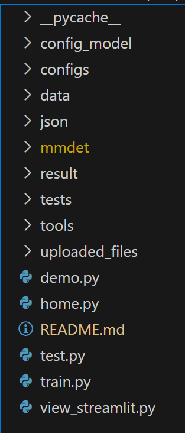

## 一，代码结构

## 二，在根目录下新建五个文件夹

### json

所有日志的json文件放在'./json' , json下的文件暂时命名为log.json
 -----> 主要用来画出我们需要的折线图

### data

数据文件放在'./data'，所有命名格式要求参考样例 

-----> 没找到合适的方法来修改CoCoDataSet

### config_model

所有配置文件放在 './config_model' 
----> 主要来进行测试和训练的，尽量不要用平台的提供的继承配置文件，没有测试是否可以

### result

手动创建 './result'、'./uploaded_files'

-----> 缓存一下数据信息

### work_dirs

训练后的权重文件放在'./workdirs' 

-----> 可以找到代码修改

## 三，修改部分训练文件的coco分类类别

由于我们预测的病理细胞类别数共5类，所以需要修改分类的类别数

### ".\mmdetection\mmdet\datasets\coco.py"

CocoDataset类的METAINFO的classes属性值修改为    ('1', '2', '3', '4', '5')

### ".\mmdetection\mmdet\datasets\class_names.py"

coco_classes方法的返回值设为    '1', '2', '3', '4', '5'

